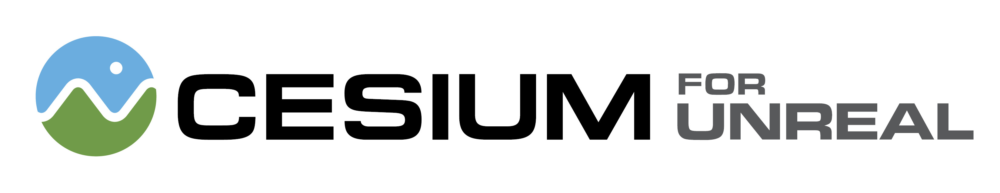
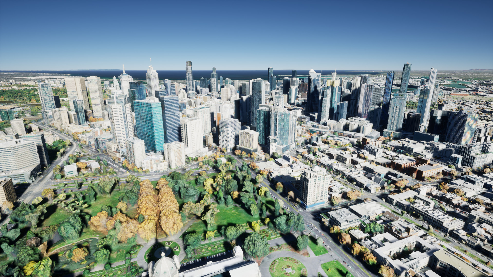
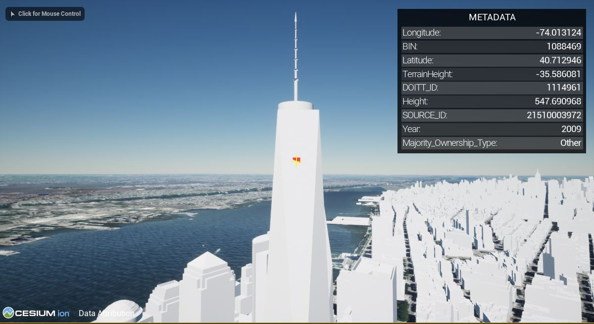
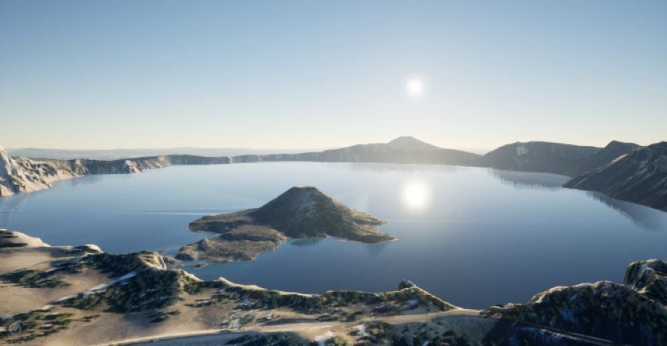
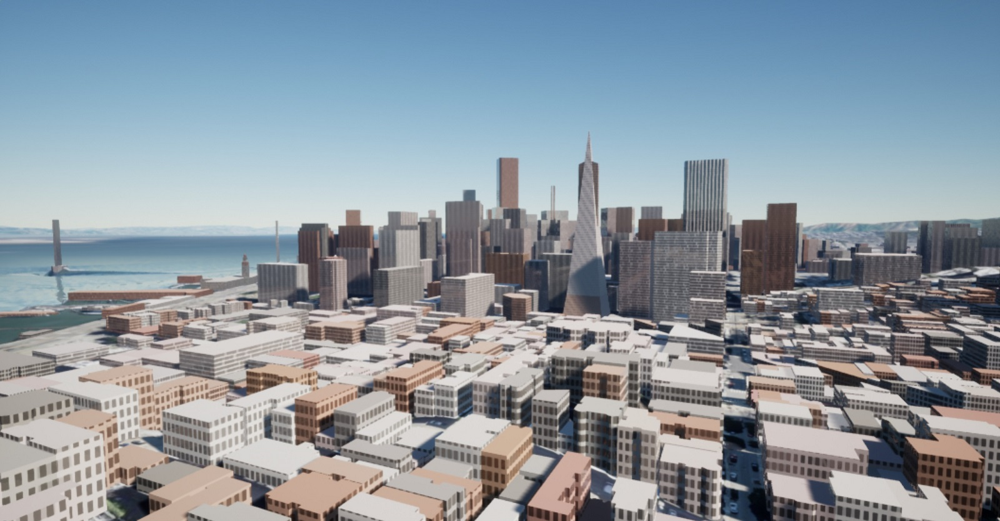

# Cesium for Unreal Samples

The [Cesium for Unreal Samples](https://cesium.com/unreal-samples-marketplace?utm_source=cesium-unreal-samples&utm_medium=github&utm_campaign=unreal) is a starter project to learn and explore the [Cesium for Unreal](https://cesium.com/unreal-marketplace?utm_source=cesium-unreal&utm_medium=github&utm_campaign=unreal) plugin.

The levels in this project will walk you through the plugin's features and demonstrate global-scale content, applications, and experiences in Unreal Engine.

*
Photogrammetry of Melbourne, Australia visualized in Unreal Engine using Cesium for Unreal. Open the <b>02_CesiumMelbourne</b> level in Cesium for Unreal Samples to experience it yourself!
*

### :rocket: Get Started

**[Download Cesium for Unreal Samples from Unreal Engine Marketplace](https://cesium.com/unreal-samples-marketplace?utm_source=cesium-unreal-samples&utm_medium=github&utm_campaign=unreal)**

You will also need to download the [Cesium for Unreal plugin from the Unreal Engine Marketplace](https://cesium.com/unreal-marketplace?utm_source=cesium-unreal&utm_medium=github&utm_campaign=unreal).

Have questions? Ask them on the [community forum](https://community.cesium.com).

## :mountain: Level Descriptions

### :one: Level 1 - Cesium World

The sample levels begin with a scene in San Francisco. You'll see [Cesium World Terrain](https://cesium.com/platform/cesium-ion/content/cesium-world-terrain/) below the camera. This level is designed to familiarize you with the core Cesium actors and components like Cesium World Terrain and Cesium Georeference.

Be sure to sign into your Cesium ion account using the Cesium button in the toolbar.

### :two: Level 2 - Melbourne Photogrammetry

In this level, explore high-resolution photogrammetry data of Melbourne. This data is streamed from Cesium ion with the 3D Tiles format, a spatial index for streaming massive 3D content over the web. 3D Tiles makes it possible to stream hundreds of gigabytes of data over the web using hierarchical level of detail, spatial subdivision, and runtime optimizations.

Be sure to change the time of day to create beautiful lighting in your scenes.

See how this level was created with the [Adding Datasets tutorial](https://cesium.com/learn/unreal/unreal-datasets/). 

### :three: Level 3 - Denver Photogrammetry with an Unreal Character Controller

In this level, explore even more high-resolution photogrammetry data of Denver using a third-person character controller. Whereas Melbourne allowed you to freely fly around and explore, in this level you'll walk right up to the real-world data. When streaming content through Cesium for Unreal, physics and gravity will continue to work as expected with your character controllers. For more information on character controllers, check out the [Using Custom Controllers tutorial](https://cesium.com/learn/unreal/unreal-custom-controllers/).

Grab some cool screenshots to share with us as you explore and customize the scenes.

 visualized in Unreal Engine using Cesium for Unreal.](Images/aerometrex-denver.jpg)
*
Photogrammetry of Union Station in Denver, CO captured by [Aerometrex](https://aerometrex.com.au/). Open <b>03_CesiumDenver</b> in the Cesium for Unreal Samples to walk around the dataset.
*

### :four: Level 4 - Using Sublevels to Explore the World

You can build experiences in different locations around the world, without even changing levels. In this level, we've added a few locations around the world that you can explore. Enter play mode and jump between locations by pressing the 1-5 keys on your keyboard. These levels are loaded in and georeferenced by working with Unreal's Sublevel feature.

You can also add your own locations, like your hometown or your favorite vacation spot. Check out the [Sublevels tutorial](https://cesium.com/learn/unreal/unreal-sublevels/) to learn how.

### :five: Level 5 - Post Processing

Combine real-world content With Unreal Engine's lighting, rendering, and post processing capabilities! Whether you want to visualize a sunset at your favorite beach, or record a timelapse at Mt. Everest, Cesium for Unreal can help you quickly create your scenes. 

This level has lighting, fog, volumetric clouds, and a post processing volume to create a picturesque scene at Mt. Fuji. You should try tweaking the setting to customize the scene and create different effects. Not sure where to start? Check out the [Lighting and Rendering tutorial](https://cesium.com/learn/unreal/unreal-post-processing/). We would love to see what you create!

### :six: Level 6 - Metadata

Cesium for Unreal enables you to access metadata encoded in your 3D Tiles datasets. In this level, explore the buildings in New York City and see what information is included in the tileset about each building.

*
Metadata of New York City buildings visualized. Open <b>06_CesiumMetadata</b> in the Cesium for Unreal Samples to explore the New York City's metadata.
*

Looking to use metadata in your project? Check out the [Visualizing Metadata tutorial](https://cesium.com/learn/unreal/unreal-visualize-metadata/) to learn more.

### :seven: Level 7 - Multiple Views

In this level, see how to create minimaps or other views of your scenes. While the 3D Tiles that are loaded depend on what the camera currently sees, Cesium for Unreal will also load tiles for secondary viewports or Scene Capture actors and components.

Press Play to explore the level, assisted by a minimap and a view from space.

### :eight: Level 8 - Clipping & Cartographic Polygons

In this level, you'll see how overlapping tilesets can be combined and unwanted details can be removed. Using the Cesium Cartographic Polygon actor, you can hide sections of tilesets. Explore the level and see how the Aerometrex Denver dataset has been inset in to Cesium World Terrain and OSM buildings. You'll also see another example of how clipping can be utilized, by cutting out a lake and replacing it with a water body and a landscape.

### :nine: Level 9 - Material Editing

In this level, visit picturesque Crater Lake, where Cesium Cartographic Polygons and material editing are used to render the water of the lake. The Cesium materials used to render tilesets can be easily customized to create any material effect you might need. For some inspiration, take a look at the materials in the `CesiumSamples/Materials` folder, and try applying them to Cesium World Terrain. 

*
Crater Lake, Oregon, visualized in Unreal Engine with Cesium for Unreal. Cesium Cartographic Polygons and an edited material allow you to render water in any location.  Open <b>09_CesiumMaterialEditing</b> to explore the scene.
*

### :keycap_ten: Level 10 - Procedural Window Materials

The samples project includes two materials that can add visual detail to city datasets like Cesium OSM Buildings. These materials generate windows on the sides of buildings that are reflective and glow at night. Additionally, one material uses OSM buildings metadata to randomize building colors based on their building type. You can use these materials in your own levels to give untextured datasets more visual variety.

*
Cesium OSM Buildings in San Francisco, California, visualized with the `MI_ProceduralWindowsMetadata` material.  Open <b>10_CesiumOSMWindows_Metadata</b> to explore the scene.
*

### Level 11 - Point Clouds

Cesium for Unreal supports rendering point cloud 3D Tilesets in addition to terrain and photogrammetry datasets. In this scene, explore several point cloud datasets around the world. Feel free to add your own point clouds as well!

### :hammer_and_wrench: Using Cesium for Unreal Samples for Development

Cesium for Unreal Samples can also be used for development and testing of the Cesium for Unreal plugin. To use this project for development, follow these steps.

1. Clone the repo with `git clone git@github.com:CesiumGS/cesium-unreal-samples.git`.
2. From the `cesium-unreal-samples/Plugins` directory, clone Cesium for Unreal using `git clone --recursive git@github.com:CesiumGS/cesium-unreal.git`.
3. Follow the instructions to [compile Cesium for Unreal](https://github.com/CesiumGS/cesium-unreal#computer-developing-with-unreal-engine).
4. Open `CesiumForUnrealSamples.uproject` in the Unreal Editor.
    * If prompted to rebuild modules, click "yes".
    * Optional: Generate Visual Studio project files manually by choosing `File -> [Refresh/Generate] Visual Studio Project` in the editor. You can also do this by right-clicking `CesiumForUnrealSamples.uproject` and clicking `Generate Visual Studio project files`.
    * Optional: You can open the project Visual Studio by opening the `CesiumForUnrealSamples.sln` solution file generated by Unreal Engine.
5. The Cesium for Unreal Samples project contains numbered levels that showcase the global scale and real-world content of Cesium for Unreal. Levels include terrain, imagery, 3D Buildings, and photogrammetry. Give them a spin and let the ideas flow!

### :green_book:License

[Apache 2.0](http://www.apache.org/licenses/LICENSE-2.0.html). Cesium for Unreal Samples is free to use as starter project for both commercial and non-commercial use.
